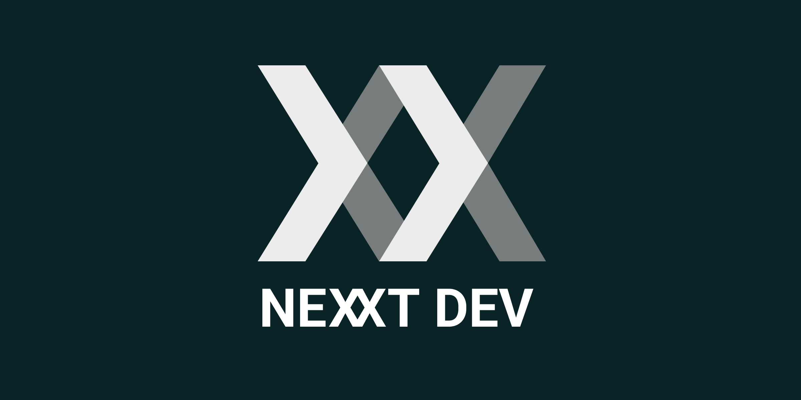

<br/>
<br/>


# Nexx E-Commerce Template  

A full-stack e-commerce starter template built with **Next.js** (frontend) and **Payload CMS** (backend), powered by **Shopnex**.  
Includes a modern storefront, robust admin panel, and flexible CMS to kickstart any online store project.  

---

## 🚀 Getting Started  

### 1. Clone the Repository  
```bash
git clone https://github.com/nexxtdeev/nexxt-ecommerce-template
cd <project-folder>
```

### 2. Remove Existing Git History  
```bash
rm -rf .git
```

### 3. Connect to Your Own GitHub Repository  
```bash
git init
git remote add origin git@github.com:<your-username>/<your-repo>.git
git add .
git commit -m "Initial commit from Nexx E-Commerce Template"
git push -u origin main
```

---

## ⚙️ Setting up CMS  

1. Go to the **CMS folder**:  
```bash
cd apps/cms
```

2. Install dependencies:  
```bash
pnpm install
```

3. Build CMS:  
```bash
pnpm build
```

4. Start CMS:  
```bash
pnpm start
```

5. Create your **first CMS user** (admin account) through the web panel.  

---

## 📝 Environment Variables  

- **Shop (frontend)**: configure `.env.local`  
  ```env
  NEXT_PUBLIC_CMS_URL=<your-cms-url>
  NEXT_PUBLIC_FRONTEND_URL=<your-frontend-url>
  ```

- **CMS (backend)**: configure `.env`  
  ```env
  # Database configuration
  DATABASE_URI=file:./dev.db
  # Secret key used by Payload CMS for encryption and session management
  PAYLOAD_SECRET=YOUR_SECRET_HERE
  
  # Next.js configuration
  NEXT_PUBLIC_SERVER_URL=http://localhost:3000
  
  # Storefront configuration
  NEXT_PUBLIC_STOREFRONT_URL=http://localhost:3020
  
  # Easy Email configuration
  NEXT_PUBLIC_EASY_EMAIL_URL=http://localhost:3040
  
  
  # Stripe API keys for payment processing
  NEXT_PUBLIC_STRIPE_IS_TEST_KEY=

  ```

---

## 🛍️ Running the Frontend  

In a separate terminal:  
```bash
cd apps/shop
pnpm dev
```

The frontend should now be available at:  
- Local: `http://localhost:3020`  
- CMS Admin Panel: `http://localhost:3000/admin`  

---

## ✅ Done  

You now have:  
- **CMS running with Payload** (admin panel, database, Stripe integration)  
- **Frontend running with Next.js** (ready to customize for your e-commerce project)  

Enjoy building with **Nexx E-Commerce Template** 🚀
